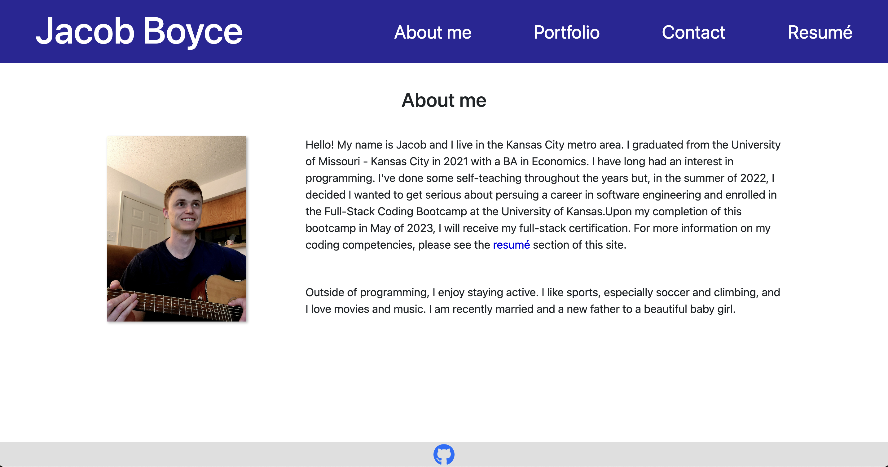

# Project Portfolio

## Description

This is a React app that showcases the skills I've developed as a programmer. The Portfolio tab contains a gallery of my work, complete with links to the applications and their GitHub repositories. There is also an 'About me' tab, a 'Contact' tab where users can send me a message via email, and a 'Resumé' tab that displays my coding competencies as well as a link to download my resumé.

Visit the application at: [https://jacob-boyce-portfolio.herokuapp.com/](https://jacob-boyce-portfolio.herokuapp.com/)
